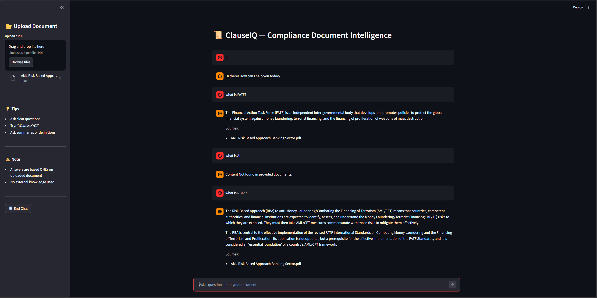

# ⚖️ ClauseIQ — Compliance Document Intelligence

ClauseIQ is a RAG (Retrieval-Augmented Generation) system that lets you upload compliance and regulatory PDFs and ask questions in plain English. Built from scratch without LangChain — every layer of the pipeline is custom implemented.

---

## The Problem

Reading through financial regulations like RBI guidelines, FATF recommendations, or AML policies is slow and painful. Finding a specific clause means manually scanning hundreds of pages. ClauseIQ solves this by letting you just ask.

---

## How It Works

1. **Upload** a PDF document
2. **Ask** any question about it in plain English
3. **Get** a precise, context-aware answer — sourced only from your document

The system never uses external knowledge. Every answer traces back to your uploaded file.

---

## Features

- Upload and chat with PDF document
- Custom RAG pipeline — no LangChain
- FAISS-based semantic search with distance threshold filtering
- Gemini 2.5 Flash for answer generation
- Answers sourced strictly from uploaded document — no hallucination from external knowledge
- Real time document processing  

---

## Architecture

```
PDF Upload
    │
    ▼
Text Extraction (pypdf)
    │
    ▼
Sentence-Based Chunking
    │
    ▼
Embedding Generation (Sentence Transformers — all-MiniLM-L6-v2)
    │
    ▼
FAISS Vector Store
    │
    ▼
Semantic Retrieval (top-k chunks by L2 distance)
    │
    ▼
Gemini 2.5 Flash (RAG prompt with retrieved context)
    │
    ▼
Answer → Streamlit UI
```

Built without LangChain — every layer of the pipeline is custom implemented for full control over chunking strategy, retrieval thresholds, and prompt design.

---

## Tech Stack

| Layer | Tool |
|---|---|
| UI | Streamlit |
| PDF Parsing | pypdf |
| Embeddings | Sentence Transformers |
| Vector Store | FAISS |
| LLM | Google Gemini 2.5 Flash |
| Language | Python |

---

## Run Locally

```bash
git clone <your-repo-link>
cd ClauseIQ

python -m venv venv
venv\Scripts\activate        # Windows
# source venv/bin/activate   # Mac/Linux

pip install -r requirements.txt
```

Add your Gemini API key to a `.env` file:

```
GEMINI_API_KEY=your_key_here
```

Then run:

```bash
streamlit run app/ui.py
```

---

## Demo



---

## Use Cases

- Financial compliance analysis (RBI, FATF, AML guidelines)
- Legal and regulatory document review
- Internal policy documentation search
- Quick clause lookup during audits

---

## Current Limitations

- Single document per session
- Text based PDFs only (scanned/image PDFs not supported)
- No persistent chat history across sessions

---

## Future Upgrades

- Multi document querying
- Hybrid search (keyword + semantic)
- Streaming responses
- Deployment as a hosted service

---
